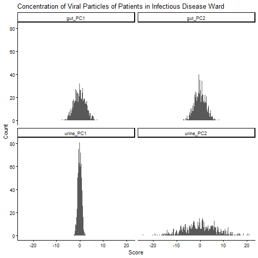
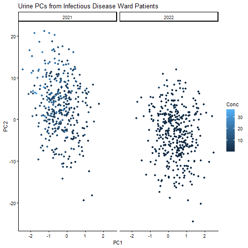
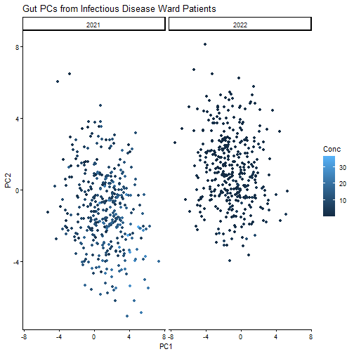

# BIOL343 Coding Challenge 3

## Group Members


``` r
# Name - Queen's Student Number

# 1. Jake Mayo - 20186062
```

**Scenario chosen** (hospital or lakes; see the instructions):
Hospital
# DO THIS FIRST {-}

Copy and paste this into your R Console to start positpal, but replace `FILENAME.Rmd` with the name you are going to use for the .R or .Rmd file you are going to upload (rename the template first, e.g. `Group_#_CC3.Rmd`, and use that exact name). **Do not include it as a code chunk.**

```
install.packages("remotes")
remotes::install_url("https://quantitative.bio/downloads/positpal.tar.gz", upgrade = "never")
positpal::start("FILENAME.Rmd")
```

Before you run it: open the project folder for this challenge in Positron (*File → Open Folder…*) so that it is your working directory, save this file in that folder under the name you will upload, and check that autosave is on (*File → Auto Save*). The first time you use positpal on a computer, `start()` will ask you to run `positpal::accept_eula()` once; do that, then run the `start()` line again. After a few minutes of work, check in the Explorer pane that the `.capture/snaps` folder inside your project is filling up with files. If it is not, or if `start()` refuses to record, run `positpal::doctor("FILENAME.Rmd")` and bring the output to tutorial or office hours. Run the `start()` line again at the start of every session you spend on this file.

# Part 1 — Import and inspect three related files

The three files are in the `data` folder: `Dataset1.csv`, `Dataset2.csv`, `Dataset3.csv`. Each row is one sample, identified by `ID` and `Date`: every patient (lake) was sampled once in 2021 and once in 2022, so the same `ID` appears twice in each file with different dates. **Do not edit the files by hand**; every correction happens in R.

## 1. Load packages

Load the packages you will use (Chapter 10, *Setup*): `dplyr`, `tidyr`, `lubridate`, `readr` and `ggplot2` (or `tidyverse`, which loads all of them).


``` r
library(tidyverse)
```

## 2. Import the three files

Import each file and save them as `data1`, `data2` and `data3` (Chapter 10, *tibbles and readr*). Open `Dataset3.csv` in a text editor first: it was exported by a collaborator whose software uses a **semicolon** to separate columns. Check the help for `read_delim()` or `read.csv()` for the argument that sets the separator.


``` r
data1 <-read_delim("./Data/Dataset1.csv")
```

```
## Rows: 794 Columns: 3
## ── Column specification ──────────────────────────────────────────────────────
## Delimiter: ","
## dbl  (2): ID, Conc
## date (1): Date
## 
## ℹ Use `spec()` to retrieve the full column specification for this data.
## ℹ Specify the column types or set `show_col_types = FALSE` to quiet this message.
```

``` r
data2 <-read_delim("./Data/Dataset2.csv")
```

```
## Rows: 788 Columns: 4
## ── Column specification ──────────────────────────────────────────────────────
## Delimiter: ","
## chr  (2): PC1, PC2
## dbl  (1): ID
## date (1): Date
## 
## ℹ Use `spec()` to retrieve the full column specification for this data.
## ℹ Specify the column types or set `show_col_types = FALSE` to quiet this message.
```

``` r
data3 <-read_delim("./Data/Dataset3.csv", delim = ";")
```

```
## Rows: 792 Columns: 4
## ── Column specification ──────────────────────────────────────────────────────
## Delimiter: ";"
## chr  (2): PC1, PC2
## dbl  (1): ID
## date (1): Date
## 
## ℹ Use `spec()` to retrieve the full column specification for this data.
## ℹ Specify the column types or set `show_col_types = FALSE` to quiet this message.
```

## 3. Inspect the data

Use `str()` on all three objects.


``` r
str(data1)
```

```
## spc_tbl_ [794 × 3] (S3: spec_tbl_df/tbl_df/tbl/data.frame)
##  $ ID  : num [1:794] 1291543 4972386 9934712 2711078 8171692 ...
##  $ Date: Date[1:794], format: "2022-05-03" "2021-05-27" ...
##  $ Conc: num [1:794] 3.131 12.808 0.211 0.439 0.327 ...
##  - attr(*, "spec")=
##   .. cols(
##   ..   ID = col_double(),
##   ..   Date = col_date(format = ""),
##   ..   Conc = col_double()
##   .. )
##  - attr(*, "problems")=<pointer: 0x00000246ad218930>
```

``` r
str(data2)
```

```
## spc_tbl_ [788 × 4] (S3: spec_tbl_df/tbl_df/tbl/data.frame)
##  $ ID  : num [1:788] 3288208 7848312 7272390 6217553 8941937 ...
##  $ Date: Date[1:788], format: "2022-12-14" "2021-11-30" ...
##  $ PC1 : chr [1:788] "-0.391" "1.033" "2.472" "2.137" ...
##  $ PC2 : chr [1:788] "1.377" "-1.116" "-5.509" "-0.606" ...
##  - attr(*, "spec")=
##   .. cols(
##   ..   ID = col_double(),
##   ..   Date = col_date(format = ""),
##   ..   PC1 = col_character(),
##   ..   PC2 = col_character()
##   .. )
##  - attr(*, "problems")=<pointer: 0x00000246ab6989e0>
```

``` r
str(data3)
```

```
## spc_tbl_ [792 × 4] (S3: spec_tbl_df/tbl_df/tbl/data.frame)
##  $ ID  : num [1:792] 3140930 9478460 3008241 3131659 4629334 ...
##  $ Date: Date[1:792], format: "2021-03-02" "2021-10-07" ...
##  $ PC1 : chr [1:792] "0.0876666666666667" "-0.476666666666667" "-0.0643333333333333" "-0.784" ...
##  $ PC2 : chr [1:792] "1.719" "0.198" "1.944" "-3.525" ...
##  - attr(*, "spec")=
##   .. cols(
##   ..   ID = col_double(),
##   ..   Date = col_date(format = ""),
##   ..   PC1 = col_character(),
##   ..   PC2 = col_character()
##   .. )
##  - attr(*, "problems")=<pointer: 0x00000246ad20e6b0>
```

**Question 1:** Which columns did R import as a type you did not expect, and what in the raw files caused it? (Look at the values in those columns.)

**Answer:**
PC1 and PC2 in datasets 2 and 3 show up as characters. Data set 3 has the word 'missing' and data set 2 has the letters 'N/A' in these columns.
## 4. Fix the missing values

The columns from Question 1 contain words where numbers are expected. Use `mutate()` (Chapter 10, *mutate() Columns*) with `as.numeric()` to convert them; R replaces anything it cannot read as a number with `NA` (the warning `NAs introduced by coercion` is expected here). Then count the missing values in each converted column with `sum(is.na())` (Chapter 10, *is.na()*).


``` r
data2 <- mutate(data2, PC1 = as.numeric(PC1), PC2= as.numeric(PC2))
```

```
## Warning: There were 2 warnings in `mutate()`.
## The first warning was:
## ℹ In argument: `PC1 = as.numeric(PC1)`.
## Caused by warning:
## ! NAs introduced by coercion
## ℹ Run ]8;;x-r-run:dplyr::last_dplyr_warnings()dplyr::last_dplyr_warnings()]8;; to see the 1 remaining warning.
```

``` r
str(data2)
```

```
## tibble [788 × 4] (S3: tbl_df/tbl/data.frame)
##  $ ID  : num [1:788] 3288208 7848312 7272390 6217553 8941937 ...
##  $ Date: Date[1:788], format: "2022-12-14" "2021-11-30" ...
##  $ PC1 : num [1:788] -0.391 1.033 2.472 2.137 0.706 ...
##  $ PC2 : num [1:788] 1.377 -1.116 -5.509 -0.606 4.724 ...
```

``` r
data3 <- mutate(data3, PC1 = as.numeric(PC1), PC2= as.numeric(PC2))
```

```
## Warning: There were 2 warnings in `mutate()`.
## The first warning was:
## ℹ In argument: `PC1 = as.numeric(PC1)`.
## Caused by warning:
## ! NAs introduced by coercion
## ℹ Run ]8;;x-r-run:dplyr::last_dplyr_warnings()dplyr::last_dplyr_warnings()]8;; to see the 1 remaining warning.
```

``` r
str(data3)
```

```
## tibble [792 × 4] (S3: tbl_df/tbl/data.frame)
##  $ ID  : num [1:792] 3140930 9478460 3008241 3131659 4629334 ...
##  $ Date: Date[1:792], format: "2021-03-02" "2021-10-07" ...
##  $ PC1 : num [1:792] 0.0877 -0.4767 -0.0643 -0.784 NA ...
##  $ PC2 : num [1:792] 1.719 0.198 1.944 -3.525 4.866 ...
```

``` r
# count the NAs
sum(is.na(data2))
```

```
## [1] 12
```

``` r
sum(is.na(data3))
```

```
## [1] 11
```

## 5. Rename the measurement columns

`data2` and `data3` both have columns called `PC1` and `PC2`. Use `rename()` (Chapter 10, *rename() Columns*) to give them names that say where they came from, for example `micro_PC1`/`micro_PC2` and `urine_PC1`/`urine_PC2` (hospital) or `invert_PC1`/`invert_PC2` and `chem_PC1`/`chem_PC2` (lakes). Check the result with `names()`.


``` r
data2<-rename(data2, gut_PC1 = PC1, gut_PC2 = PC2)
data3<-rename(data3, urine_PC1 = PC1, urine_PC2 = PC2)
names(data2)
```

```
## [1] "ID"      "Date"    "gut_PC1" "gut_PC2"
```

``` r
names(data3)
```

```
## [1] "ID"        "Date"      "urine_PC1" "urine_PC2"
```

**Question 2:** What would have happened to these column names if you had joined `data2` and `data3` without renaming? (Try it in the Console if you are not sure.)

**Answer:**
It would have kept both datasets' PC1s and 2s seperate in the same column by creating two categories of each: PC_.x and PC_.y. 
## 6. Make sure `Date` is a date

Check `class()` of the `Date` column in each of the three objects. If any of them is `character`, convert it with `ymd()` from `lubridate` (Chapter 10, *date Objects*). All three must be the same class before you join, or the join will refuse to match them.


``` r
class(data1$Date)
```

```
## [1] "Date"
```

``` r
class(data2$Date)
```

```
## [1] "Date"
```

``` r
class(data3$Date)
```

```
## [1] "Date"
```

# Part 2 — Join the files

## 7. Full join by ID and Date

Combine the three objects into one called `all_data` with `full_join()` (Chapter 10, *Join Datasets*), matching rows that have the same `ID` **and** the same `Date`: `by = c("ID", "Date")`. Two joins are needed. Check the dimensions.


``` r
all_data <- full_join(data1, data2, by = c("ID","Date"))
all_data <- full_join(all_data, data3, by = c("ID","Date"))
dim(all_data)
```

```
## [1] 800   7
```

## 8. Compare the join verbs

Using only `data1` and `data2`, report the number of rows returned by `inner_join()`, `left_join()`, `right_join()` and `full_join()` (all `by = c("ID", "Date")`). `nrow()` is enough; do not print the tables.


``` r
# inner
inner<-inner_join(data1, data2, by = c("ID","Date"))
nrow(inner)
```

```
## [1] 782
```

``` r
# left
left<-left_join(data1, data2, by = c("ID","Date"))
nrow(left)
```

```
## [1] 794
```

``` r
# right
right<-right_join(data1, data2, by = c("ID","Date"))
nrow(right)
```

```
## [1] 788
```

``` r
# full
full<-full_join(data1, data2, by = c("ID","Date"))
nrow(full)
```

```
## [1] 800
```

**Question 3:** The four numbers differ. Explain which rows each verb keeps, and what that tells you about samples that are in one file but not the other.

**Answer:**
Inner join only keeps rows with both date and ID matching, left join keeps all rows from data1 and only data from data2 that matches, right join keeps all rows from data2 and only data from data1 that matches and full join keeps everything. 
It suggests that data1 has more samples than data2.
# Part 3 — Dates, summaries and ordering

## 9. Add year and month

Add a `Year` column and a `Month` column to `all_data` with `mutate()` and the `lubridate` functions `year()` and `month()` (Chapter 10, *Extracting Components*).


``` r
all_data<- mutate(all_data, Year = factor(year(Date)), Month = month(Date, label = TRUE))
```

## 10. Summarise concentration by year

Use `group_by()` and `summarise()` (Chapter 10, *summarise() + group_by()*) to calculate the mean and standard deviation of `Conc` for each `Year`. Remember `na.rm = TRUE` (Chapter 10, *NA and na.rm()*). Save the result as `year_summary` and print it.


``` r
year_summary <- group_by(all_data, Year)
year_summary <- summarise(year_summary, mean= mean(Conc, na.rm=TRUE), sd=sd(Conc, na.rm=TRUE))

print(year_summary)
```

```
## # A tibble: 2 × 3
##   Year    mean    sd
##   <fct>  <dbl> <dbl>
## 1 2021  10.2    6.14
## 2 2022   0.964  1.46
```

**Question 4:** Does concentration differ between the two years? Answer in one or two sentences from the table.

**Answer:**
The concentration is much higher in 2021 and has a greater standard deviation. 
## 11. The five highest concentrations

Use `arrange()` with `desc()` (Chapter 10, *arrange() Rows*) and `select()` (Chapter 10, *select() Columns*) to show the five samples with the highest `Conc`, with only the `ID`, `Year` and `Conc` columns. Pipe the steps together with `%>%` (Chapter 10, *%>%*).


``` r
top5<- all_data %>%
    select(ID, Year, Conc) %>%
    arrange(desc(Conc)) %>%
    head(5)
top5
```

```
## # A tibble: 5 × 3
##        ID Year   Conc
##     <dbl> <fct> <dbl>
## 1 9050729 2021   36.4
## 2 1829307 2021   34.9
## 3 1290775 2021   31.8
## 4 6739807 2021   27.4
## 5 9456994 2021   27.2
```

# Part 4 — Reshape

## 12. Wide to long

Starting from `all_data`, the four measurement columns you renamed in Section 5 (e.g. `micro_PC1`, `micro_PC2`, `urine_PC1`, `urine_PC2`) are in *wide* format. Use `pivot_longer()` (Chapter 10, *pivot_longer*) on `all_data` to stack those four columns into two, `Measure` (which column the value came from) and `Score` (the value). Save the result as `long_data` and check it with `head()` and `dim()`.


``` r
long_data <- pivot_longer(all_data, cols=c(gut_PC1, gut_PC2, urine_PC1, urine_PC2), names_to="Measure", values_to= "Score")
head(long_data)
```

```
## # A tibble: 6 × 7
##        ID Date        Conc Year  Month Measure    Score
##     <dbl> <date>     <dbl> <fct> <ord> <chr>      <dbl>
## 1 1291543 2022-05-03  3.13 2022  May   gut_PC1    2.92 
## 2 1291543 2022-05-03  3.13 2022  May   gut_PC2   -1.80 
## 3 1291543 2022-05-03  3.13 2022  May   urine_PC1 -0.974
## 4 1291543 2022-05-03  3.13 2022  May   urine_PC2  5.38 
## 5 4972386 2021-05-27 12.8  2021  May   gut_PC1    1.84 
## 6 4972386 2021-05-27 12.8  2021  May   gut_PC2   -1.42
```

``` r
dim(long_data)
```

```
## [1] 3200    7
```

Now use `long_data` to draw histograms of `Score` with `facet_wrap()` so that each `Measure` gets its own panel (Chapter 4 and Chapter 7). Choose a sensible `binwidth`, add axis labels and a title, and use `theme_classic()`.


``` r
ggplot(long_data, aes(x=Score))+
    geom_histogram(binwidth=0.2)+
    facet_wrap(~Measure)+
    theme_classic()+
    labs(title="Concentration of Viral Particles of Patients in Infectious Disease Ward", X="Score", y="Count")
```

```
## Ignoring unknown labels:
## • X : "Score"
```

```
## Warning: Removed 63 rows containing non-finite outside the scale range
## (`stat_bin()`).
```



## 13. Long to wide

Each `ID` was sampled once in each year. Starting from `all_data`, `select()` only `ID`, `Year` and `Conc`, then use `pivot_wider()` (Chapter 10, *pivot_wider*) so that there is one row per `ID` with a column for each year. Save it as `wide_conc`. Then add a `Change` column equal to the second year minus the first (column names that start with a digit must be wrapped in back-ticks, e.g. `` `2022` ``), and count how many IDs increased.


``` r
wide_conc <- all_data %>%
    select(ID, Year, Conc) %>%
    pivot_wider(names_from = Year, values_from= Conc) %>%
    mutate(Change = `2022` - `2021`)
head(wide_conc)
```

```
## # A tibble: 6 × 4
##        ID `2022` `2021` Change
##     <dbl>  <dbl>  <dbl>  <dbl>
## 1 1291543 3.13     5.52  -2.39
## 2 4972386 0.0354  12.8  -12.8 
## 3 9934712 0.211   11.5  -11.3 
## 4 2711078 0.439   16.5  -16.1 
## 5 8171692 0.327    1.34  -1.01
## 6 7859592 7.08     5.87   1.21
```

``` r
sum(wide_conc$Change >0, na.rm=TRUE)
```

```
## [1] 19
```

``` r
sum(is.na(wide_conc$Change))
```

```
## [1] 6
```
**Question 5:** How many IDs have a higher concentration in the second year than in the first, and how many have `NA` for the change? Why are there NAs?

**Answer:**
19 entries have a positive change from year to year, 6 have NA. I assume this is because there was not data for those entries in both years.
# Part 5 — Test the hypothesis visually

## 14. PC1 against PC2

Use `ggplot()` to plot `PC1` on the x-axis and `PC2` on the y-axis for **one** of the two measurement sets, with `colour = Conc` so that concentration is shown by colour, and `facet_wrap()` by `Year`. Include `theme_classic()`, axis labels and a title (Chapter 4 and Chapter 7). Repeat for the other measurement set if it helps you answer Question 6. A few points will be **grey**: those are samples with no concentration value (`Conc` is `NA` because they were not in `Dataset1.csv`), so no colour can be assigned. Ignore them when you answer Question 6, or drop them first with `filter(!is.na(Conc))`.


``` r
urine_PC <- all_data %>%
    filter(!is.na(Conc)) %>%
    ggplot(aes(x=urine_PC1, y=urine_PC2,colour = Conc))+
        geom_point()+
        facet_wrap(~Year)+
        theme_classic()+
        labs(title="Urine PCs from Infectious Disease Ward Patients", x= "PC1", y="PC2")       
urine_PC
```

```
## Warning: Removed 19 rows containing missing values or values outside the scale range
## (`geom_point()`).
```



``` r
gut_PC <- all_data %>%
    filter(!is.na(Conc)) %>%
    ggplot(aes(x=gut_PC1, y=gut_PC2,colour = Conc))+
        geom_point()+
        facet_wrap(~Year)+
        theme_classic()+
        labs(title="Gut PCs from Infectious Disease Ward Patients", x= "PC1", y="PC2")       
gut_PC
```

```
## Warning: Removed 24 rows containing missing values or values outside the scale range
## (`geom_point()`).
```



**Question 6:** What do the data say about the hypothesis in your scenario (patients with similar viral loads have similar gut microbes and urine metabolites, or lakes with similar arsenic levels have similar invertebrate communities and water chemistry)? Answer in a short paragraph from visual inspection of your figures. For now, assume that any strong pattern is statistically robust; later we will learn to test this with models.

**Answer:**
The visualized data supports the hypothesis that viral load is related to gut biome and urine metabolites. In both figures, we see a gradient of concentration as the difference in PC1 and PC2 becomes greater. For both figures, this pattern is only visible for the 2021 data, the 2022 data is too noisy to make anything of. In the urine PCs, it looks like high PC1 and low PC2 is associated with high viral load and low PC1, high PC2 is associated with a lesser load. For the gut PCs, high PC1 and low PC2 looks related to a lower viral load while high PC2, low PC1 is associated with a greater load. Because the PCs are not comparable variables, this anti-directionality does not damage the hypothesis that differences in gut microbes and urine metabolites are related to viral load. 

**Question 7:** Read the scenario you did not choose. What, if anything, would you have done differently in the code? What does this tell you about coding as a transferable skill?

**Answer:**
I think it would be almost exactly the same with the exception of labels and titles and potentially more attention paid to unit specificity. This suggests that coding and understanding data are pretty universal skills. 
# DO THIS LAST {-}

When your document is finished and knitted, copy and paste this into the R Console to stop positpal and create your coding log. **Do not include it as a code chunk.**

```
positpal::stop_capture()
positpal::export_capture()
```

`export_capture()` prints the name and location of the `my-capture-YYYYMMDD-HHMMSS.zip` it creates beside this file. **Each group member** uploads their own `.zip` to the **"CC3 — Coding Log (individual)"** dropbox on OnQ; the group's `.Rmd` and knitted `.html` go to your section's **TUT02-CC3** or **TUT03-CC3** folder. Submissions without the log are incomplete. If `export_capture()` fails, zip the `.capture` folder yourself and upload that instead.
